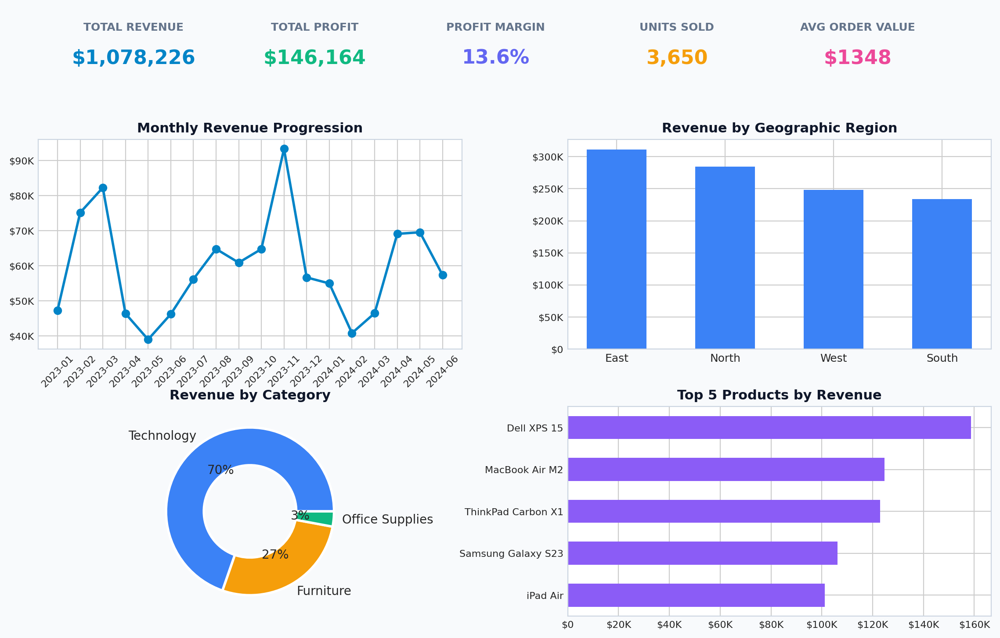
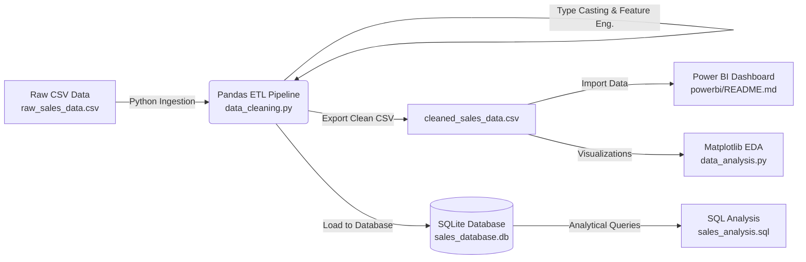
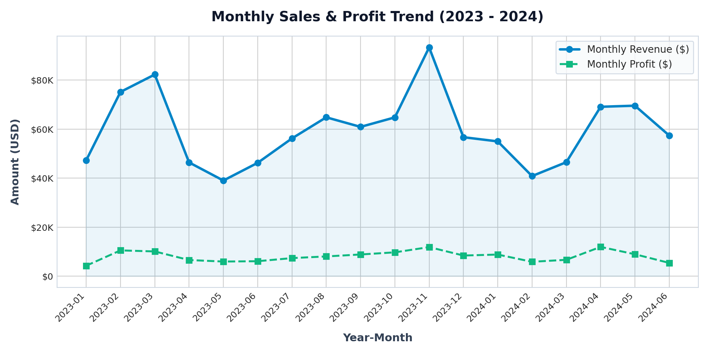
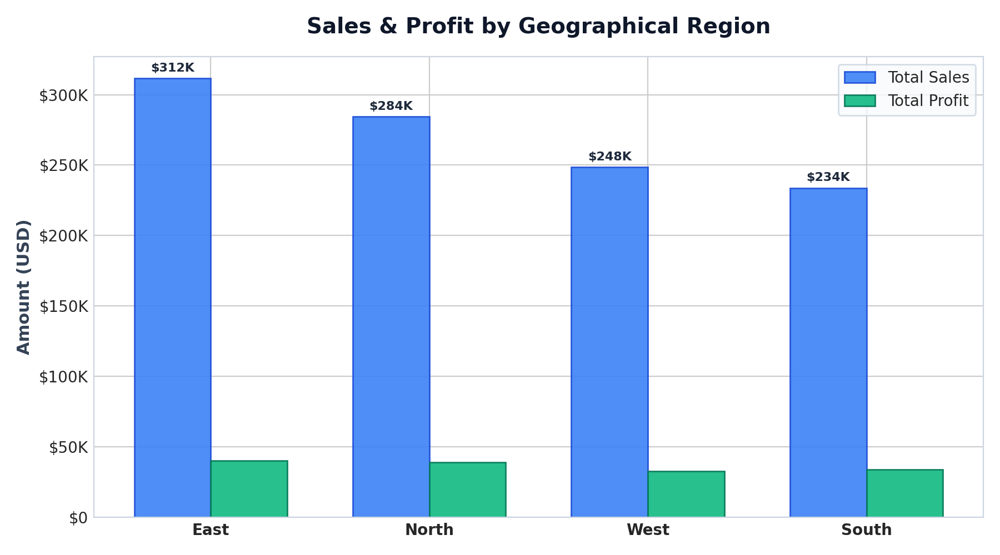
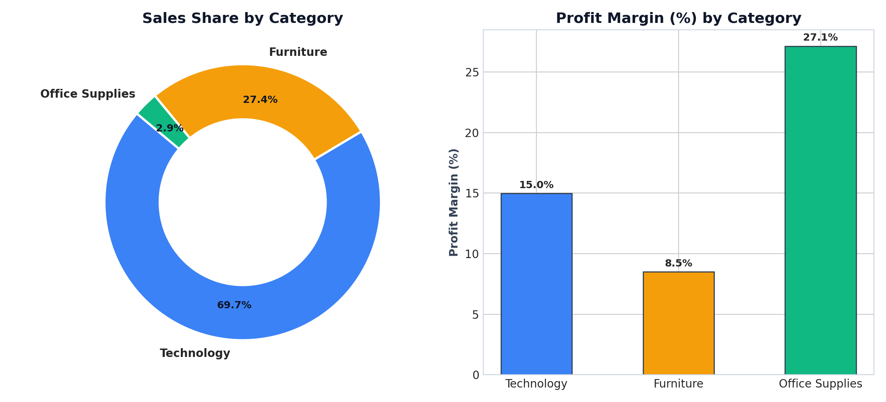
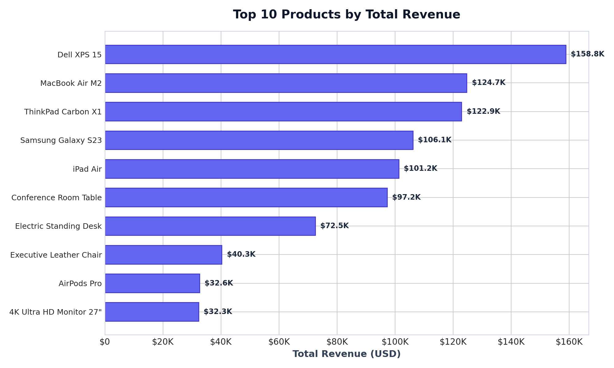

# 📈 Sales Data Analysis & Business Intelligence Dashboard

[](https://www.python.org/)
[](https://pandas.pydata.org/)
[](https://www.sqlite.org/)
[](https://powerbi.microsoft.com/)
[](https://opensource.org/licenses/MIT)

An end-to-end data engineering and business intelligence project demonstrating the complete data lifecycle: from ingesting raw, messy sales data to Python/Pandas data cleaning, SQLite relational storage, modular SQL analytics, and an interactive Power BI dashboard.

Built for **Cloud Data Engineering** portfolio evaluation and technical interviews (e.g., HCLTech / Berribot).

---

## 📸 Executive Dashboard Preview



---

## 📑 Table of Contents
1. [Project Overview](#project-overview)
2. [Problem Statement](#problem-statement)
3. [Objectives](#objectives)
4. [Technology Stack](#technology-stack)
5. [Project Architecture & Workflow](#project-architecture--workflow)
6. [Repository Structure](#repository-structure)
7. [Step-by-Step Setup & Execution](#step-by-step-setup--execution)
8. [Data Cleaning Pipeline (Python & Pandas)](#data-cleaning-pipeline-python--pandas)
9. [Relational Database & SQL Analytics (SQLite)](#relational-database--sql-analytics-sqlite)
10. [Exploratory Data Analysis & Visualizations](#exploratory-data-analysis--visualizations)
11. [Power BI Dashboard & DAX Measures](#power-bi-dashboard--dax-measures)
12. [Key Business Insights](#key-business-insights)
13. [Future Cloud Improvements (HCLTech Context)](#future-cloud-improvements-hcltech-context)
14. [Interview Preparation Guide](#interview-preparation-guide)

---

## 🎯 Project Overview

In enterprise retail and e-commerce, raw transactional data arriving from distributed sales endpoints is frequently plagued by duplicates, unrecorded values, and conflicting data types. Without automated data pipelines, business analysts work with unreliable figures.

This project implements an automated **Extract, Transform, Load (ETL)** workflow:
1. **Extract**: Ingests 800+ raw transactional records containing realistic anomalies.
2. **Transform**: Cleans, standardizes, deduplicates, and enriches data with business metrics in Python.
3. **Load**: Exports clean CSVs and populates a relational SQLite database.
4. **Analyze**: Runs structured SQL queries to evaluate key business performance indicators.
5. **Visualize**: Delivers an interactive Power BI dashboard for executive decision-making.

---

## ⚠️ Problem Statement

A mid-sized retail enterprise operates across four geographical regions (East, North, West, South) selling products across Technology, Furniture, and Office Supplies. The leadership team faced three challenges:
* **Dirty Data**: Source exports contained duplicate orders, missing fields, and irregular date notations.
* **Lack of Central Storage**: Analysts were sharing ad-hoc spreadsheets without a unified database.
* **Unclear Margin Drivers**: Management had no visibility into whether promotional discounts were eating into overall profits.

---

## 🚀 Objectives

* **Automate Data Hygiene**: Build a reliable Python data cleaning script that deduplicates rows, imputes missing values, and enforces type consistency.
* **Structured Storage**: Create a normalized SQLite database table to support relational SQL queries.
* **Actionable Analytics**: Write clean, commented SQL queries to answer core business questions (revenue, profit, top products, regional leaders).
* **Interactive Business Intelligence**: Create a Power BI dashboard with simple, high-performing DAX measures and interactive slicers.
* **Interview Readiness**: Provide clear explanations and talking points for freshers preparing for Cloud Data Engineering roles.

---

## 💻 Technology Stack

| Technology | Purpose | Key Modules / Features |
| :--- | :--- | :--- |
| **Python 3.10+** | Programming & ETL Orchestration | `pandas`, `numpy`, `matplotlib`, `sqlite3`, `datetime` |
| **Pandas** | Tabular Data Cleaning & Transformation | `drop_duplicates()`, `fillna()`, `to_datetime()`, `select_dtypes()` |
| **SQLite 3** | Relational Database Storage | `CREATE TABLE`, `INSERT`, file-based database (`.db`) |
| **SQL** | Analytical Querying | `GROUP BY`, `SUM()`, `AVG()`, `ROUND()`, `CASE WHEN`, `LIMIT` |
| **Matplotlib** | Data Visualization & Plotting | Time-series trends, horizontal bar charts, donut charts |
| **Power BI** | Interactive Business Dashboard | DAX measures (`SUM`, `DIVIDE`, `AVERAGE`), KPI Cards, Slicers |
| **CSV** | Data Interchange Format | `raw_sales_data.csv`, `cleaned_sales_data.csv` |

---

## 🏗️ Project Architecture & Workflow



### End-to-End Steps:
1. **Raw Generation / Landing**: 815 raw transactions generated with missing customer names, discounts, regions, and duplicate rows.
2. **Pandas ETL**: Script scrubs whitespace, eliminates 15 duplicate records, imputes missing values using business rules, parses mixed date formats into ISO `YYYY-MM-DD`, and calculates sales metrics.
3. **Database Population**: Script writes the cleaned dataset into `data/sales_database.db` inside table `sales`.
4. **SQL Analytics**: 10 SQL queries extract business answers from the database.
5. **BI Reporting**: Power BI consumes the cleaned dataset to display interactive KPI cards, monthly trends, regional comparisons, and category distributions.

---

## 📁 Repository Structure

```
Sales-Data-Analysis-Dashboard/
│
├── data/
│   ├── generate_raw_data.py      # Generates 800+ realistic raw sales rows
│   ├── raw_sales_data.csv        # Raw dataset with duplicates & missing values
│   ├── cleaned_sales_data.csv    # Transformed, validated production dataset
│   └── sales_database.db         # Self-contained SQLite relational database
│
├── python/
│   ├── data_cleaning.py          # Production ETL pipeline (Clean, Validate, DB Load)
│   ├── data_analysis.py          # Exploratory analysis & automated chart generation
│   └── run_sql_queries.py        # Terminal runner for SQL queries on SQLite DB
│
├── sql/
│   └── sales_analysis.sql        # 10 commented beginner-friendly business queries
│
├── powerbi/
│   └── README.md                 # Complete Power BI setup guide, DAX formulas & layout
│
├── screenshots/
│   ├── executive_dashboard_summary.png   # 4-in-1 executive summary dashboard
│   ├── monthly_sales_trend.png          # Monthly revenue & profit time-series
│   ├── sales_by_region.png              # Geographical sales comparison
│   ├── sales_by_category.png            # Donut chart & profit margin by category
│   └── top_10_products.png              # Horizontal bar chart of top products
│
├── interview/
│   └── interview_preparation.md  # 15 HCLTech interview Q&As, 60s pitch, data flow
│
├── requirements.txt              # Project dependencies (pandas, matplotlib, numpy)
└── README.md                     # Comprehensive project documentation
```

---

## ⚡ Step-by-Step Setup & Execution

### 1. Clone the Repository
```bash
git clone https://github.com/Jeelanimohammad/Project1.git
cd Project1
```

### 2. Set Up Virtual Environment (Recommended)
```bash
# Windows
python -m venv venv
venv\Scripts\activate

# macOS / Linux
python3 -m venv venv
source venv/bin/activate
```

### 3. Install Dependencies
```bash
pip install -r requirements.txt
```

### 4. Run the Pipeline
```bash
# Step 4a: (Optional) Re-generate raw dataset
python data/generate_raw_data.py

# Step 4b: Run the Data Cleaning & ETL Pipeline
python python/data_cleaning.py

# Step 4c: Run SQL Analysis on SQLite Database
python python/run_sql_queries.py

# Step 4d: Generate Visualizations & Charts
python python/data_analysis.py
```

---

## 🧹 Data Cleaning Pipeline (Python & Pandas)

The script `python/data_cleaning.py` executes automated transformations:

| Cleaning Step | Problem in Raw Data | Transformation Applied | Business Justification |
| :--- | :--- | :--- | :--- |
| **Deduplication** | 15 duplicate rows | `df.drop_duplicates()` | Eliminates duplicate transactions caused by network retries. |
| **Missing Discounts** | 12 missing values | `df['Discount'].fillna(0.0)` | Missing discount signifies full retail price transaction. |
| **Missing Customers** | 10 missing values | `df['Customer Name'].fillna('Guest Customer')` | Retains sales transaction without corrupting identified customer metrics. |
| **Missing Regions** | 8 missing values | `df['Region'].fillna(df['Region'].mode()[0])` | Imputed with the statistical mode (most frequent territory). |
| **Date Parsing** | Mixed styles (`YYYY-MM-DD`, `DD/MM/YYYY`) | `pd.to_datetime(format='mixed')` | Standardizes all dates to ISO `YYYY-MM-DD` for SQL & BI sorting. |
| **Text Stripping** | Extra spaces (`" West "`) | `str.strip()` | Eliminates whitespace to prevent broken SQL `GROUP BY` buckets. |
| **Type Coercion** | Integers vs Floats | `astype(int)` / `astype(float)` | Guarantees numeric integrity for calculations. |
| **Feature Engineering**| Derived attributes | Calculated `Sales`, `Profit Margin (%)`, `Year-Month` | Provides pre-computed measures for fast queries. |

---

## 🗄️ Relational Database & SQL Analytics (SQLite)

The cleaned data is loaded directly into SQLite table `sales`. File `sql/sales_analysis.sql` contains 10 analytical queries:

### Sample Query: Regional Performance
```sql
SELECT 
    Region,
    COUNT(Order_ID) AS Total_Orders,
    ROUND(SUM(Sales), 2) AS Total_Sales,
    ROUND(SUM(Profit), 2) AS Total_Profit,
    ROUND((SUM(Profit) / SUM(Sales)) * 100, 2) AS Profit_Margin_Pct
FROM sales
GROUP BY Region
ORDER BY Total_Sales DESC;
```
**Output:**
```
Region  Total_Orders  Total_Sales  Total_Profit  Margin_Pct
  East           217    311541.55      40340.70       12.95%
 North           193    284432.60      39121.70       13.75%
  West           196    248491.75      32617.91       13.13%
 South           194    233760.15      34083.92       14.58%
```

### Sample Query: Discount Impact on Profitability
```sql
SELECT 
    CASE 
        WHEN Discount = 0 THEN 'No Discount (0%)'
        WHEN Discount <= 0.10 THEN 'Low Discount (1-10%)'
        ELSE 'High Discount (>10%)'
    END AS Discount_Bracket,
    COUNT(Order_ID) AS Order_Count,
    ROUND(SUM(Sales), 2) AS Total_Sales,
    ROUND(SUM(Profit), 2) AS Total_Profit,
    ROUND((SUM(Profit) / SUM(Sales)) * 100, 2) AS Profit_Margin_Pct
FROM sales
GROUP BY Discount_Bracket
ORDER BY Total_Sales DESC;
```
**Output:**
```
    Discount_Bracket  Order_Count  Total_Sales  Total_Profit  Margin_Pct
Low Discount (1-10%)          314    466429.15      76728.76       16.45%
High Discount (>10%)          325    400382.90      23488.27        5.87%
    No Discount (0%)          161    211414.00      45947.20       21.73%
```

---

## 📊 Exploratory Data Analysis & Visualizations

The script `python/data_analysis.py` computes summary metrics and automatically exports charts into `screenshots/`:

| Visualization | Description | Chart Preview |
| :--- | :--- | :--- |
| **Monthly Trend** | Revenue and profit progression over 2023–2024. |  |
| **Sales by Region** | Compares gross revenue and profits across East, North, West, and South. |  |
| **Category Breakdown** | Donut chart of revenue share and bar chart of profit margin %. |  |
| **Top 10 Products** | Highest grossing products led by laptops and enterprise furniture. |  |

---

## 📈 Power BI Dashboard & DAX Measures

Detailed instructions and visual configurations are in [powerbi/README.md](powerbi/README.md).

### Core DAX Measures
```dax
-- Total Sales
Total Sales = SUM(cleaned_sales_data[Sales])

-- Total Profit
Total Profit = SUM(cleaned_sales_data[Profit])

-- Total Quantity Sold
Total Quantity = SUM(cleaned_sales_data[Quantity])

-- Safe Profit Margin (guards against divide-by-zero)
Profit Margin = DIVIDE([Total Profit], [Total Sales], 0)

-- Average Discount Rate
Average Discount = AVERAGE(cleaned_sales_data[Discount])

-- Average Order Value (AOV)
Average Order Value = DIVIDE([Total Sales], DISTINCTCOUNT(cleaned_sales_data[Order ID]), 0)
```

---

## 💡 Key Business Insights

1. **Technology Dominates Topline Revenue**:
   * Technology represents **69.7% ($751K)** of total sales and **77%** of net profit, driven by high-ticket items like **Dell XPS 15** ($158.8K) and **MacBook Air M2** ($124.7K).
2. **High Discounts Severely Erode Margins**:
   * Zero-discount sales yield a healthy **21.7%** profit margin.
   * High-discount (>10%) sales yield only **5.9%** margin.
   * *Recommendation*: Put discount thresholds on high-cost technology products.
3. **Office Supplies Has the Highest Relative Margin**:
   * While generating lower gross revenue ($31.5K), Office Supplies boasts the highest profit margin (**27.1%**).
4. **Regional Consistency**:
   * Sales are evenly balanced across all four territories (East leads at $311.5K, followed by North at $284.4K, West at $248.5K, and South at $233.8K), with South achieving the highest margin rate (**14.6%**).

---

## ☁️ Future Cloud Improvements (HCLTech Context)

In a Cloud Data Engineering environment at HCLTech, this local architecture can be modernized using cloud patterns:

1. **Cloud Object Storage (Data Lake)**:
   * Store landing CSV files in **Azure Data Lake Storage Gen2 (ADLS)** or **AWS S3** organized in Medallion architecture (`bronze/raw`, `silver/cleansed`, `gold/curated`).
2. **Distributed Big Data Processing**:
   * Migrate Pandas ETL to **PySpark** running on **Azure Databricks** or **AWS EMR** for scaling to billions of records.
3. **Cloud Data Warehousing**:
   * Load clean datasets into **Snowflake**, **Azure Synapse Analytics**, or **Amazon Redshift** with automated partition keys and cluster keys.
4. **Pipeline Orchestration**:
   * Automate the daily batch pipeline using **Azure Data Factory (ADF)** or **Apache Airflow** DAGs with data quality validation (e.g. Great Expectations) and alerting.
5. **Real-time Streaming**:
   * Connect point-of-sale streams to **Azure Event Hubs** / **Apache Kafka** and process through **Spark Structured Streaming**.

---

## 🎓 Interview Preparation Guide

A dedicated interview preparation guide with 15 detailed questions is available at:
👉 **[interview/interview_preparation.md](interview/interview_preparation.md)**

### Quick 60-Second Elevator Pitch
> *"I designed an end-to-end Sales Data Analysis & Business Intelligence project simulating enterprise retail workflows. I started with raw, messy sales data featuring missing values, duplicates, and mixed date formats. Using Python and Pandas, I built an ETL pipeline to clean, validate, and enrich the data. I loaded the clean records into an SQLite relational database, authored analytical SQL queries for business metrics, and connected the dataset to an interactive Power BI dashboard with custom DAX measures. This demonstrates my core data engineering foundation in data ingestion, transformation, relational schema design, and business reporting."*

---

## 👨‍💻 Author

* **Jeelani Mohammad**
* Computer Science & Engineering (Data Science)
* GitHub: [@Jeelanimohammad](https://github.com/Jeelanimohammad)

---

## 📄 License
This project is open-source and available under the [MIT License](LICENSE).
